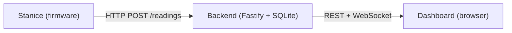
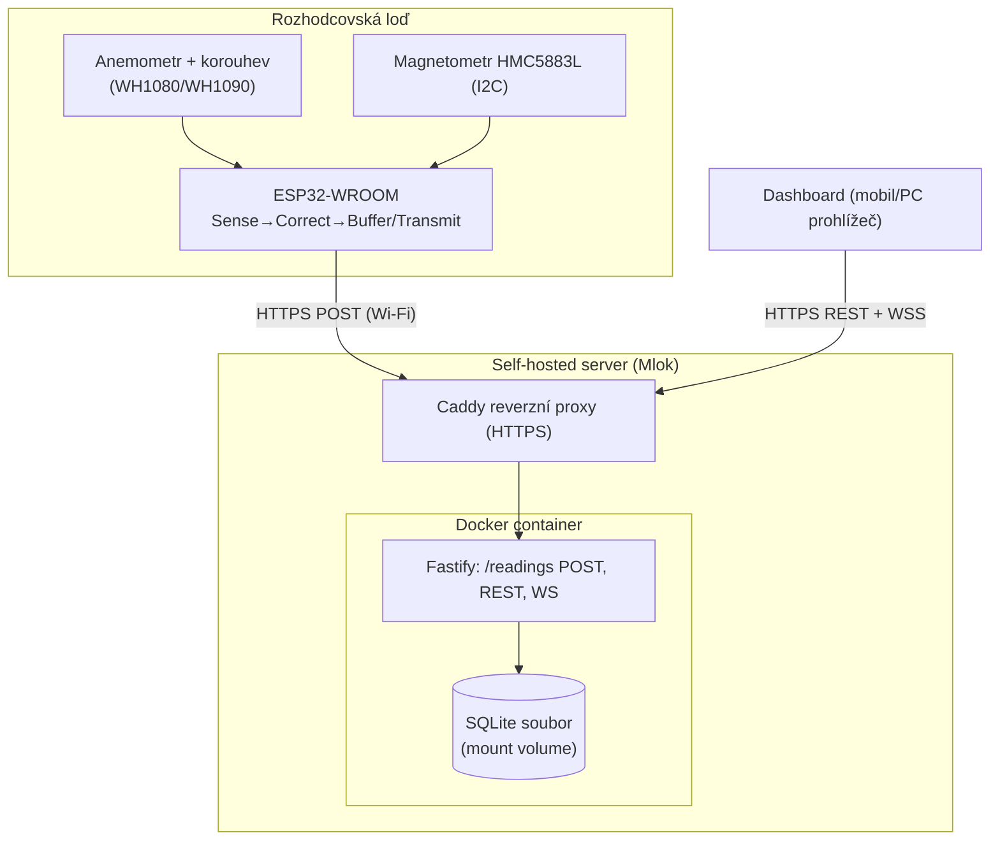

# Architecture Spine — Gustik

## Design Paradigm

**Layered pipeline**, jednosměrný tok dat po celé délce systému: `Sense → Correct → Buffer/Transmit → Ingest → Store → Serve`. Každá fáze zná jen kontrakt fáze před sebou, nikdy její vnitřní implementaci.

| Fáze | Kde běží | Odpovědnost |
| --- | --- | --- |
| Sense | Stanice (ESP32, firmware) | čtení anemometru/korouhve/magnetometru |
| Correct | Stanice (ESP32, firmware) | yaw-korekce, převod na SI jednotky a 8 oktantů |
| Buffer/Transmit | Stanice (ESP32, firmware) | lokální buffer při výpadku, odeslání přes Wi-Fi |
| Ingest | Backend (Fastify) | příjem přes jediný HTTP endpoint, validace |
| Store | Backend (SQLite) | perzistence, řazení podle `captured_at` |
| Serve | Backend (Fastify REST + WS) | historie, aktuální hodnota, live push |
| (Render) | Dashboard (browser) | zobrazení — mimo pipeline, čistě konzument Serve vrstvy |

## Invariants & Rules



### AD-1 — Jediná zapisovací hranice

- **Binds:** FR-3, FR-4, FR-6
- **Prevents:** druhou cestu zápisu (přímý DB přístup, debug endpoint), která by obešla backfill/pořadí.
- **Rule:** Stanice zapisuje měření výhradně přes jeden HTTP POST endpoint na Backendu. Nic jiného nikdy nevkládá řádky do úložiště měření.

### AD-2 — Pořadí podle času měření, ne příjmu

- **Binds:** FR-4, FR-8
- **Prevents:** že dávka dat doplněná po výpadku (backfill) rozhodí pořadí historie; že se `captured_at` garance tiše rozpadne přesně během výpadků, kdy je synchronizace hodin nejméně spolehlivá.
- **Rule:** Každý záznam nese `captured_at` (čas měření na Stanici) odděleně od `received_at` (čas příjmu na Backendu). Veškeré řazení při ukládání i dotazování je podle `captured_at`, nikdy podle pořadí vložení. Stanice synchronizuje hodiny přes SNTP (Wi-Fi) při bootu a po každém reconnectu; pokud se synchronizace od bootu nikdy nepovedla, `captured_at` na Backendu spadá zpět na odhad z `received_at` — přijatý kompromis (best-effort, stejně jako FR-4), ne tvrdá garance.

### AD-3 — Jeden proces, jedno úložiště

- **Binds:** all (Backend)
- **Prevents:** předimenzování konkurenčního modelu (fronta, druhá databáze) pro objem dat jedné stanice.
- **Rule:** Backend běží jako jeden proces (Fastify) nad jedním SQLite souborem (`better-sqlite3`). Žádná fronta, cache ani druhé úložiště v v1.

### AD-4 — Korekce probíhá na zařízení, ne na Backendu

- **Binds:** FR-1, FR-2 `[ADOPTED — přímo dané zněním PRD FR-1/FR-2]`
- **Prevents:** rozjetí korekční logiky mezi firmwarem a backendem, nebo její duplicitu.
- **Rule:** Yaw-korekce (magnetometr) a převod na SI jednotky probíhají na Stanici před odesláním. Backend přijímá vždy jen hotové `wind_speed_ms` a 8-oktantový směr — nikdy surové čtení senzoru ani surové osy magnetometru.

### AD-5 — Směr větru jako oktant, ne stupně

- **Binds:** FR-2, FR-7, FR-8, FR-10
- **Prevents:** že si nějaká vrstva (typicky Dashboard) vymyslí falešnou přesnost (např. "247°"), kterou hardware neumí dodat.
- **Rule:** Směr větru se ukládá i přenáší jako celé číslo 0–7 (jeden z 8 kardinálních směrů), nikdy jako stupně.

### AD-6 — Live push je optimalizace, REST je zdroj pravdy

- **Binds:** FR-7, FR-11
- **Prevents:** že se logika stáří/neplatnosti dat (FR-11) postaví jen na WebSocketu a tiše se rozbije při jeho výpadku.
- **Rule:** WebSocket kanál pro živé hodnoty je best-effort. Dashboard se při reconnectu nebo podezření na zastaralost vždy dorovná přes REST `/readings/latest` a `/readings/history` — ty jsou jediný zdroj pravdy.

### AD-7 — Jednosměrná závislost

- **Binds:** all
- **Prevents:** zkratku typu "Dashboard čte rovnou ze Stanice" nebo "Backend zná konkrétní typ senzoru".
- **Rule:** Závislost jde vždy jen `Stanice → Backend → Dashboard`. Backend neobsahuje žádnou hardwarově specifickou znalost (typy senzorů, magnetometru). Dashboard mluví výhradně s Backend API, nikdy se Stanicí přímo.

### AD-8 — Payload obálka a idempotence

- **Binds:** FR-3, FR-4, AD-1, AD-2
- **Prevents:** že se firmware a backend rozejdou v tom, jestli `POST /readings` nese jeden záznam nebo dávku (backfill po výpadku typicky pošle stovky záznamů najednou); že ztracené ACK při reconnectu způsobí duplicitní řádky v historii.
- **Rule:** `POST /readings` vždy přijímá JSON pole 1..N záznamů (živé odeslání je pole o délce 1). Každý záznam nese firmwarem vygenerované `client_id`, které Backend vynucuje jako `UNIQUE` — opakované odeslání je no-op, nikdy duplicitní řádek.

### AD-9 — Tvar WS zprávy a přesynchronizace po backfillu (zpřesňuje AD-6)

- **Binds:** FR-7, FR-11, `backend/serve`, Dashboard
- **Prevents:** že se tvar WS zprávy rozejde od REST tvaru; že Dashboard zůstane zastaralý po doplnění backfill dat bez signálu k přesynchronizaci.
- **Rule:** Každá WS zpráva nese identický tvar záznamu jako REST (`capturedAt`, `windSpeedMs`, `windDirOctant`, `rssiDbm`) — nikdy částečný nebo jinak tvarovaný push. Vložení backfill záznamu (`capturedAt` starší než poslední, který Dashboard viděl) vyšle holou WS událost `history-changed`, která řekne Dashboardu znovu načíst `/readings/history` — ne pokus o inkrementální patch grafu.

### AD-10 — Autentizace zápisu

- **Binds:** FR-3, AD-1
- **Prevents:** že otevřený, neautentizovaný zápisový endpoint na veřejném internetu umožní komukoliv vložit falešná data do zobrazení, na kterém stojí reálné bezpečnostní rozhodnutí.
- **Rule:** `POST /readings` vyžaduje statický sdílený token (bearer) — na Stanici v konfiguračním souboru (stejná konvence jako Wi-Fi credentials, FR-14), na Backendu jako env proměnná. Toto NENÍ obecný autentizační systém — čtení Dashboardu (FR-9) zůstává vědomě bez přihlašování; token hlídá jen tento jediný zápisový endpoint.

## Consistency Conventions

| Concern | Convention |
| --- | --- |
| Naming | SQLite sloupce `snake_case` (`captured_at`, `wind_speed_ms`, `wind_dir_octant`, `rssi_dbm`); HTTP JSON klíče `camelCase`; převod probíhá výhradně ve vrstvě DB přístupu, nikde jinde. |
| Data & formáty | Časová razítka jako ISO-8601 UTC řetězec na drátě. Rychlost větru vždy v m/s v klidu (FR-1); uzly (FR-10) jsou čistě zobrazovací převod v Dashboardu, nikdy uložená hodnota — `/readings/history` NIKDY nepřijímá parametr pro jednotku, vrací vždy SI, převod dělá výhradně klient. Směr větru jako oktant 0–7 (AD-5). |
| State & cross-cutting | Wi-Fi přihlašovací údaje (FR-14) žijí v samostatném konfiguračním souboru na flash Stanice, nikdy zakompilované ve firmware zdrojáku. Firmware se při chybě odeslání nikdy neblokuje ani nezastavuje vzorkování — vždy spadne do lokálního bufferu (FR-4) a pokračuje. |

## Stack

| Name | Version |
| --- | --- |
| Firmware jazyk/framework | C++ / Arduino framework (`framework-arduinoespressif32`, stabilní 2.x větev) |
| Build nástroj (firmware) | PlatformIO Core, spouštěný přes `uv tool run platformio` |
| Magnetometr knihovna | knihovna podporující jak pravý HMC5883L, tak QMC5883L die (např. `DFRobot_QMC5883`) — **ne** `jarzebski/Arduino-HMC5883L` samotný, protože pravé HMC5883L čipy jsou dnes discontinued a naprostá většina prodávaných GY-271/GY-273 modulů nese pod HMC5883L potiskem ve skutečnosti QMC5883L die s jinou I2C adresou (0x0D vs. 0x1E) a jiným registrovým mapováním — reálné riziko při nákupu součástky, ověřit při objednávce. |
| Backend runtime | Node.js 24 (Active LTS) |
| Backend framework | Fastify 5.11.x |
| Úložiště | SQLite přes `better-sqlite3` 13.0.x |
| Live push | `@fastify/websocket` |
| Statické assety | `@fastify/static` |
| Dashboard | vanilla JS + Chart.js 4.5.x, bez frontendového frameworku/build kroku |
| Docker base image | `node:24-bookworm-slim` (glibc) — vědomě ne Alpine/musl, protože `better-sqlite3` má tam nekonzistentní prebuilt binárky a hrozí kompilace ze zdroje při buildu image. |
| Nasazení | Docker / Docker Compose, HTTPS přes existující Caddy reverzní proxy `[ADOPTED — dáno addendem]` |

## Structural Seed



```text
backend/
  src/
    ingest/        # POST /readings — validace, zápis (AD-1, AD-2)
    store/          # SQLite schema + přístup (better-sqlite3), jediné místo se snake_case<->camelCase převodem
    serve/          # REST (latest, history) + WS broadcast (AD-6)
    static/         # dashboard.html, dashboard.js, chart.js vendored
  data/             # SQLite soubor (Docker volume mount)
  Dockerfile
  docker-compose.yml

firmware/
  src/
    sense/          # čtení anemometru, korouhve, magnetometru
    correct/        # yaw-korekce, převod na m/s a oktant (AD-4, AD-5)
    transmit/        # HTTP klient + lokální buffer (FR-4)
    config/         # Wi-Fi credentials + ingest token soubor, mimo firmware zdroják (AD-10)
  platformio.ini
```

### Schéma `readings` (pinned, ne ilustrativní)

| Sloupec | Typ | Nullable | Poznámka |
| --- | --- | --- | --- |
| `id` | INTEGER PK | ne | interní, nikdy nejde na drát jako identita záznamu |
| `client_id` | TEXT | ne | z firmwaru, `UNIQUE` — idempotence (AD-8) |
| `captured_at` | TEXT (ISO-8601 UTC) | ne | čas měření na Stanici (AD-2) |
| `received_at` | TEXT (ISO-8601 UTC) | ne | čas příjmu na Backendu |
| `clock_synced` | INTEGER (bool) | ne | zda Stanice měla SNTP sync v době měření (AD-2) |
| `wind_speed_ms` | REAL | ne | SI, vždy m/s (AD-6 konvence) |
| `wind_dir_octant` | INTEGER 0–7 | ne | AD-5 |
| `rssi_dbm` | INTEGER | **ano** | `NULL` před prvním úspěšným Wi-Fi scanem po bootu — FR-6 čtecí strana (`serve`) musí `NULL` zvládnout, ne předpokládat vždy číslo |
| `backfilled` | INTEGER (bool) | ne | `true`, pokud záznam dorazil mimo živé odeslání |

### Deployment & Environments

- Docker restart policy: `unless-stopped`.
- SQLite soubor na named volume (přežije restart/redeploy kontejneru).
- `GET /health` — vrací 200, jakmile jde otevřít SQLite; used by Caddy/manuální kontrolou, ne automatizovaný alerting.
- **Deferred (vědomě, ne mlčením):** zálohování SQLite souboru a monitoring/alerting nad rámec `/health` — přijatelná mezera pro jednu regatu/jednu stanici v v1, viz PRD priorita "funkční živé čtení > historický graf > vyladěná mechanika".

## Capability → Architecture Map

| Feature (PRD §4) | Lives in | Governed by |
| --- | --- | --- |
| 4.1 Měření větru (FR-1, FR-2) | `firmware/src/sense`, `firmware/src/correct` | AD-4, AD-5 |
| 4.2 Konektivita a odolnost (FR-3–FR-6) | `firmware/src/transmit`, `backend/src/ingest`, `backend/src/serve` (FR-6 čtecí strana — RSSI musí být dohledatelné, ne jen zapsané) | AD-1, AD-2, AD-8, AD-10 |
| 4.3 Dashboard (FR-7–FR-11) | `backend/src/serve`, `backend/src/static` | AD-6, AD-7, AD-9 |
| 4.4 Napájení (FR-12) | mimo softwarovou architekturu — hardwarová/mechanická otázka | — |
| 4.5 Mechanická instalace (FR-13) | mimo softwarovou architekturu | — |
| 4.6 Nastavení a zprovoznění — FR-14 | `firmware/src/config` | Consistency Conventions (State & cross-cutting), AD-10 |
| 4.6 Nastavení a zprovoznění — FR-15 | `backend/src/static` (návod jako stránka) | — (čistě obsahový požadavek, žádný invariant ho neřídí) |

## Deferred

- **Umístění magnetometru** (stožárek vs. paluba) — čistě mechanická/elektro otázka (délka I2C sběrnice); architektonicky nerozhodné, dokud je magnetometr I2C-připojený k ESP32. Řeší se v mechanické fázi (`addendum.md`).
- **Přesná kapacita lokálního bufferu** (FR-4, 4h placeholder) — závisí na skutečné flash paměti ESP32 a zvoleném intervalu vzorkování; doladit na úrovni firmware epiky, ne zde.
- **Přesný interval vzorkování** (FR-1, ~2–5s placeholder) — doladit podle chování senzoru a UX dashboardu při implementaci.
- **PlatformIO fallback na Arduino-ESP32 core 3.x** — oficiální PlatformIO nemá k 2026 podporu 3.x větve; pokud stabilní 2.x větev narazí na blokující problém, aktivně udržovaný komunitní fork `pioarduino/platform-espressif32` je zadokumentovaná záložní cesta, ne architektonické rozhodnutí teď.
- **Fyzický přepínač břeh/mobil hotspot** (FR-14) — potvrdí/zamítne se podle spolehlivosti automatického fallbacku v elektro fázi.
- **Multi-stanice, multi-regata agregace** — explicitně mimo v1 (PRD §5); pokud přijde, AD-3 (jeden proces/jedno úložiště) je první invariant k přehodnocení.
- **OTA aktualizace firmwaru** — mimo v1 (PRD §6.2); firmware se nahrává kabelem.
- **Tilt/IMU kompenzace magnetometru** — mimo v1 (PRD §4.2, §6.2); pokud se přidá v2, dotkne se AD-4 (co přesně "Correct" fáze na Stanici počítá).
